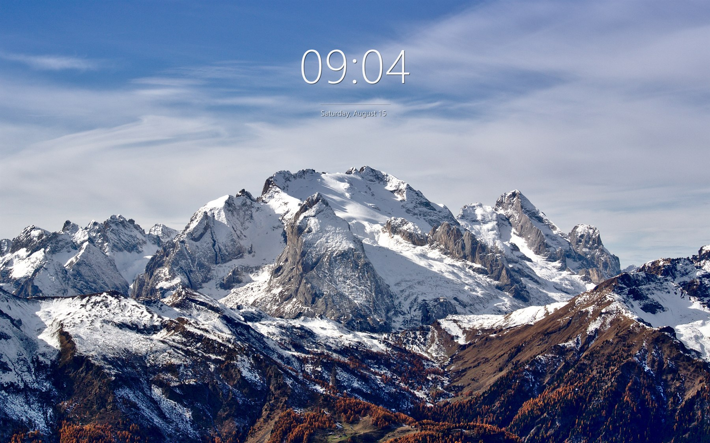

<div align="center">

# FeatherWall

### Live wallpapers for Windows that don't eat your laptop.

Any video or image on your desktop, plus a clock widget that looks designed rather than
bolted on. One process, no browser engine, no launcher, no account.

[](https://github.com/RitvikDayal/featherwall/actions/workflows/ci.yml)
[](LICENSE)
[](#install)
[](https://dotnet.microsoft.com/download)

</div>



---

## Look at it

Every screenshot here is a real capture from a 2560x1600 display at 150% scaling. Nothing is
mocked up or retouched. The wallpapers are the ones shipped in FeatherWall's own gallery, so you
can reproduce any of them in about four clicks.

### Video, playing live on the desktop


That is a real screen recording, not a mockup: a 4000x2250 clip decoding on the desktop with the
clock ticking over it, while the desktop stays fully usable underneath.


<sub><i>Big Buck Bunny</i>, (c) copyright 2008 Blender Foundation, <a href="https://peach.blender.org">peach.blender.org</a>, <a href="https://creativecommons.org/licenses/by/3.0/">CC BY 3.0</a>.</sub>

### The clock takes any font you own

Nine anchor positions, any installed typeface, any size and colour, optional seconds, optional
date, optional hairline rule. The font picker renders each family in its own face while you are
scrolling it.

| Bahnschrift Light, bottom left, with seconds | Cascadia Mono, top right |
|---|---|
|  |  |

| Georgia, centred |
|---|
|  |

<sub>Hubble Ultra Deep Field (NASA and the European Space Agency, public domain). <i>The Earth seen from Apollo 17</i> (NASA, public domain). <i>Alone in the unspoilt wilderness</i>, David Marcu, CC0. Full credits in <a href="THIRD-PARTY-NOTICES.md">THIRD-PARTY-NOTICES.md</a>.</sub>

### Settings that apply while you watch

The panel opens with a live miniature of the clock. It is drawn by the same renderer that paints
your desktop, so the preview cannot drift from the real thing. It follows your Windows light and
dark setting too.

| Clock | Wallpaper | Behaviour |
|---|---|---|
|  |  |  |

### Everything from the tray

<div align="center">


</div>

---

## What it costs you

These are measurements, not estimates. Each row came from a sampled 30 to 40 second window on a
running instance.

> Test rig: Windows 11 Pro 26200, RTX 5090 laptop, 24 logical cores, 2560x1600 at 150% scaling,
> .NET 10, Release build, single monitor.

| State | CPU (whole machine) | CPU (one core) | Memory (working set) | GPU |
|---|---|---|---|---|
| Still image | 0.03 % | 0.8 % | 151 MB | 0 % |
| Video, auto-paused | 0.01 % | 0.2 % | 246 MB | 0 % |
| Video, 1080p H.264 playing | 1.0 % | 24 % | 199 MB | 50 % |
| Video, 4K H.264 playing | 0.9 % | 22 % | 270 MB | 73 % |

The first CPU column is what Task Manager shows you. The second is the same measurement divided
by one core instead of twenty-four, because a 1 % figure on a machine this wide deserves the
honest denominator next to it.

A still wallpaper is genuinely free. It gets drawn once and then nothing happens: no GPU work, no
timers, 0.03 % CPU. If you only ever use images, FeatherWall costs you 151 MB of RAM and little
else.

Pausing is the whole battery story. Put a fullscreen app in front, lock the session, connect over
RDP or switch on battery saver, and playback stops rather than throttling. Rendering is entirely
event driven, so a paused wallpaper schedules no timers, no frames and no wakeups.

It also stays where it starts. Memory and threads were flat across 30 consecutive full re-applies,
which is the path a laptop hits every time it docks or changes monitors: 250 MB to 278 MB, 56
threads to 63. That used to go very differently, and the [honest notes](#honest-notes) below
explain what changed.

<sub>On battery specifically: system draw sat at 31 to 33 W across all three states on this laptop, which is within noise for isolating a single process. FeatherWall's share is not separable from that, so there is no watts figure here. The pause behaviour above is the honest version of that claim.</sub>

---

## Why this exists

Wallpaper engines have a habit of being enormous. Several processes, mixed runtimes, an embedded
browser to draw a looping MP4, a launcher, an account, a storefront. Then Windows 11 24H2 changed
how the desktop is composed and a lot of them started painting black rectangles.

FeatherWall is the other bet.

One process and one runtime. Raw Win32, Direct3D 11 and DirectComposition, with WinRT MediaPlayer
in frame-server mode for decoding. No WPF, no WinUI, no WebView2, no CEF, no player subprocess.
`featherwall.exe` is the entire application.

It is built for the current Windows desktop. FeatherWall detects and supports both desktop
topologies, the classic `WorkerW` layout and the Windows 11 24H2+ raised desktop where Progman
opts out of GDI redirection, and it renders through DirectComposition, the same path the shell
itself uses. [`docs/architecture.md`](docs/architecture.md) covers that properly and is the most
interesting file in the repository.

There is no account, no telemetry and no network traffic unless you ask for it. The only time
FeatherWall reaches the internet is when you click a gallery item to download it.

---

## Install

You need the [.NET 10 SDK](https://dotnet.microsoft.com/download) on Windows 10 1809 or newer.

```powershell
git clone https://github.com/RitvikDayal/featherwall
cd featherwall
dotnet build -c Release
.\src\FeatherWall\bin\Release\net10.0-windows10.0.19041.0\featherwall.exe
```

A feather appears in your tray. Right-click it and pick **Set wallpaper** for your own file, or
**Gallery** to pull something public domain. Double-click the tray icon for the settings panel.

| Flag | Does |
|---|---|
| `--settings` | Opens the settings panel |
| `--diag` | Prints the detected desktop topology and monitor layout |
| `--exit` | Stops the running instance |

> Releases are unsigned today, and a program that reaches into shell windows is exactly the shape
> security heuristics dislike. Build from source, or choose *More info* then *Run anyway*. Code
> signing through SignPath Foundation is on the roadmap.

---

## Features

Video wallpapers in MP4 and H.264 out of the box, plus MOV, AVI, WMV and WebM. Looping happens
inside the media pipeline so there is no seam, and playback is muted by default and hardware
decoded. Images cover PNG, JPEG, BMP, TIFF and animated GIF.

The clock is the part people notice. Large light-weight time, a hairline rule, a small dimmed
date underneath. It takes any installed font at any size, sits at any of nine anchors, does 12 or
24 hour with optional seconds, and has adjustable colour, opacity and shadow. It is click-through
by construction, so it never gets in the way of your desktop icons.

Everything else: per-monitor wallpapers, Fill, Fit and Stretch modes, DPI-aware rendering, a full
tray menu, JSON config for anything the UI does not expose, and auto-pause on fullscreen apps,
session lock, remote desktop and battery saver. If explorer.exe restarts or the shell rebuilds the
wallpaper layer, FeatherWall re-attaches itself, and it puts your original wallpaper back when it
exits.

---

## The gallery is deliberately boring

Pexels, Unsplash and Pixabay all explicitly prohibit wallpaper apps in their terms, so FeatherWall
does not touch them. The gallery is a static manifest of genuinely public domain and CC0 media
from NASA and Wikimedia Commons, downloaded straight from the source when you click it. No API
key, no backend, no grey area.

8 of the 11 entries carry a SHA-1 that gets verified after download, and a mismatch is a hard
failure. The other three, all NASA-hosted videos, are unpinned today and download without
verification. That is [issue #1](https://github.com/RitvikDayal/featherwall/issues/1) and it is a
good first contribution.

---

## Configuration

The tray menu and settings panel cover the common cases. Everything lives in
`%APPDATA%\FeatherWall\config.json`:

```json
{
  "wallpapers": [{ "monitor": "*", "path": "C:\\wallpapers\\aurora.webm" }],
  "fit": "Fill",
  "muteVideo": true,
  "volume": 0.3,
  "clock": {
    "enabled": true,
    "anchor": "TopCenter",
    "marginX": 48,
    "marginY": 96,
    "twentyFourHour": true,
    "showSeconds": false,
    "showDate": true,
    "separator": true,
    "fontSize": 150,
    "fontFamily": "Segoe UI Light",
    "color": "#F0FFFFFF",
    "shadow": true
  },
  "pause": { "onFullscreen": true, "onBatterySaver": true, "onRemoteSession": true }
}
```

`monitor` takes a device name such as `\\.\DISPLAY1`, or `"*"` for all of them. Logs are written to
`%LOCALAPPDATA%\FeatherWall\featherwall.log`.

FeatherWall decodes through the OS media pipeline, so H.264 and MP4 work everywhere. HEVC needs
the paid HEVC Video Extensions, and VP9 and AV1 need the free extensions from the Microsoft Store.
Gallery entries are labelled when they need one.

---

## Honest notes

Things that are true and worth saying out loud.

CPU while a video plays is about 1 % of the machine, which is about 24 % of a single core. That is
the cost of copying every decoded frame onto the composition surface and presenting it, and it is
not zero. A still image is free, and auto-pause means the video is not running most of the time
anyway, but the number is the number.

The re-apply leak is fixed, and it was bad. Until recently every full re-apply, which includes
display changes, monitor hot-plug and explorer restarts, stranded roughly 27 threads and 24 MB
permanently. A disposed WinRT `MediaPlayer` holds onto its Media Foundation worker threads until
the runtime collects it, because projected child objects keep COM references that the player's own
`Dispose` cannot release. A laptop that docked a few times a day would drift past 500 MB and 129
threads. The pipeline is now reclaimed explicitly at teardown, and 30 back-to-back re-applies move
memory by under 30 MB.

Quitting used to hang. `SystemParametersInfo(SPI_SETDESKWALLPAPER)` with `SPIF_SENDCHANGE`
broadcasts to every top-level window and waits for each one to answer, and it was running on the UI
thread during shutdown. One busy application that was not pumping messages and `featherwall.exe`
would never exit. It now writes the setting without the blocking broadcast and notifies other
applications asynchronously.

Some things have not been verified on real hardware: multi-monitor layouts, the classic `WorkerW`
topology (the development machine is a 24H2+ raised desktop), and recovery from an explorer.exe
restart. Those code paths exist and are unit-tested where unit tests can reach, but nobody has
exercised them on hardware yet. If you have a second monitor or a Windows 10 machine, that is the
single most useful thing you could contribute.

---

## Contributing

Contributions are welcome, and there is a fair amount of low-hanging fruit. Start with the
[good first issue](https://github.com/RitvikDayal/featherwall/labels/good%20first%20issue) label,
or the [help wanted](https://github.com/RitvikDayal/featherwall/labels/help%20wanted) label if you
have hardware this project does not.

[CONTRIBUTING.md](CONTRIBUTING.md) has the ground rules. The short version: `dotnet test` should be
green before you open a pull request, which takes under a second for the 54 tests currently in the
suite, and anything touching interop or rendering needs to say which desktop topology you tested
it on. Please also read the [Code of Conduct](CODE_OF_CONDUCT.md).

Security issues go through [SECURITY.md](SECURITY.md) rather than the public tracker.

## Roadmap

Slideshows and playlists, more widgets such as battery and now-playing, and a drag-to-position
edit mode for the clock. On the engine side: an `IMFMediaEngine` backend, NativeAOT single-file
publishing, and an optional mpv backend for codecs Media Foundation will not touch. On the release
side: a winget package, signed builds and an ARM64 CI leg.

## License

[MIT](LICENSE). Gallery media is public domain or CC0 and documented per entry in
[THIRD-PARTY-NOTICES.md](THIRD-PARTY-NOTICES.md).
