<div align="center">

# FeatherWall

### Live wallpapers for Windows that don't eat your laptop.

Any video or image on your desktop, plus widgets that read your machine and look designed
rather than bolted on. One process, no browser engine, no launcher, no account.

[](https://github.com/RitvikDayal/featherwall/actions/workflows/ci.yml)
[](LICENSE)
[](#install)
[](https://dotnet.microsoft.com/download)

</div>

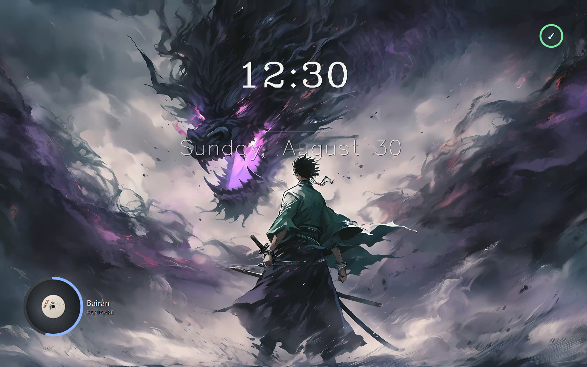

---

## Look at it

Every screenshot is a real capture from a 2560x1600 display at 150% scaling. Nothing is mocked up
or retouched, with one labelled exception below: the battery halo strip. The wallpapers ship in
FeatherWall's own gallery, so you can reproduce any of them in about four clicks.

### Video, playing live on the desktop

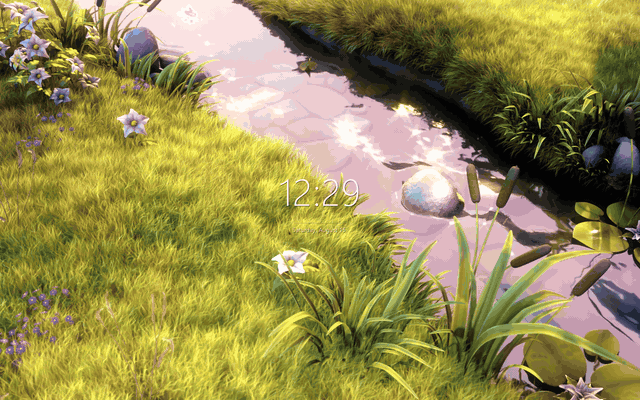

That is a real screen recording, not a mockup: a 4000x2250 clip decoding on the desktop with the
clock ticking over it, while the desktop stays fully usable underneath.

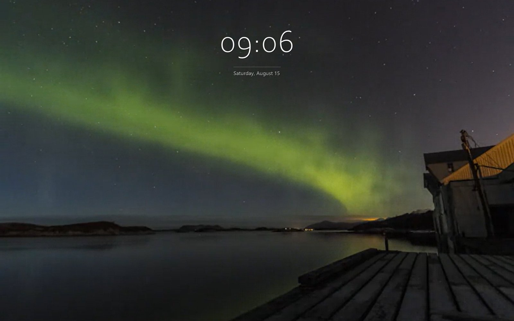

<sub><i>Big Buck Bunny</i>, (c) copyright 2008 Blender Foundation, <a href="https://peach.blender.org">peach.blender.org</a>, <a href="https://creativecommons.org/licenses/by/3.0/">CC BY 3.0</a>.</sub>

### Widgets that read your machine

New in v0.2.0. Both read the operating system — no network call, no account — and both stay off
until you turn the info widget on.

**The now-playing record.** Real album artwork from the Windows media session, on a disc that
turns at 33⅓ rpm with the track's progress on the rim. Any app with media controls counts,
including a browser tab.

<div align="center">

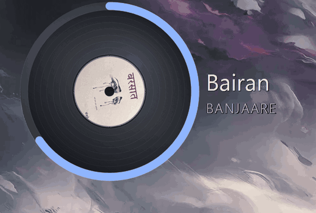

</div>

<sub>One revolution, captured off the desktop. It stops dead when playback stops, the desktop is covered, or the display sleeps.</sub>

**The battery halo.** The arc is the charge, the colour steps with it, and a bolt sits beside the
number while charging — a tick at full.

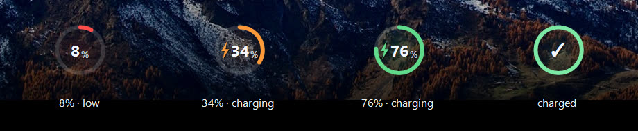

<sub>Drawn by the real renderer and composited into a strip — a laptop is only ever in one charge state at a time.</sub>

### The clock takes any font you own

Nine anchor positions, any installed typeface, any size and colour, optional seconds, optional
date, optional hairline rule. The font picker renders each family in its own face while you are
scrolling it.

| Bahnschrift Light, bottom left, with seconds | Cascadia Mono, top right |
|---|---|
| 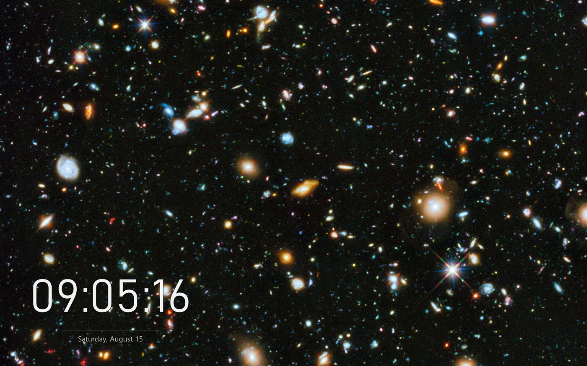 | 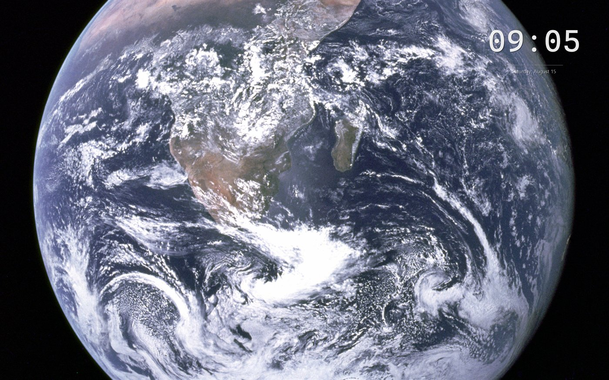 |

| Georgia, centred |
|---|
| 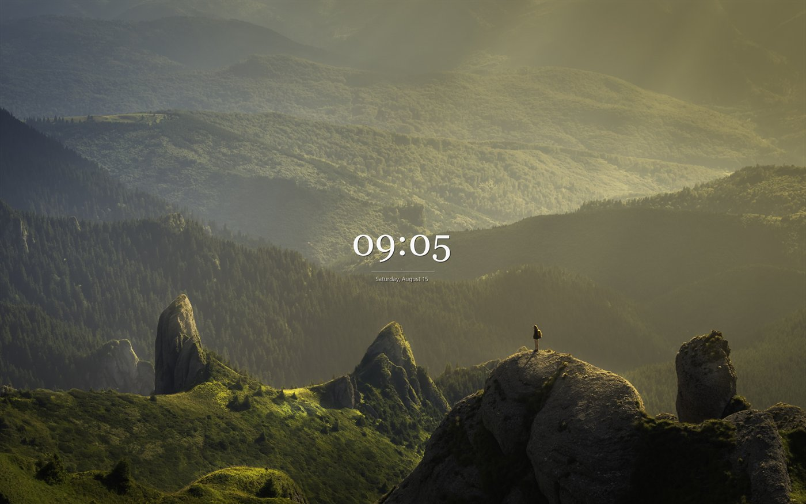 |

<sub>Hubble Ultra Deep Field (NASA and the European Space Agency, public domain). <i>The Earth seen from Apollo 17</i> (NASA, public domain). <i>Alone in the unspoilt wilderness</i>, David Marcu, CC0. Full credits in <a href="THIRD-PARTY-NOTICES.md">THIRD-PARTY-NOTICES.md</a>.</sub>

### Settings that apply while you watch

The panel opens with a live miniature of the clock. It is drawn by the same renderer that paints
your desktop, so the preview cannot drift from the real thing. It follows your Windows light and
dark setting too.

| Clock | Wallpaper | Behaviour |
|---|---|---|
| 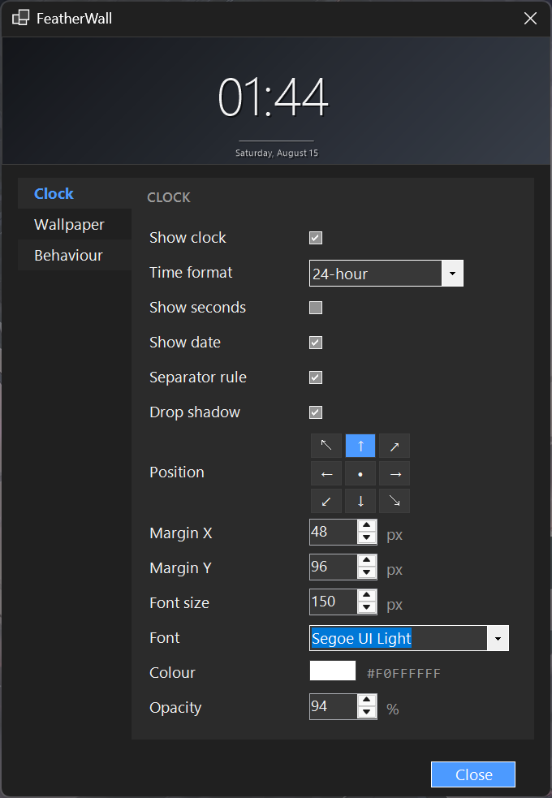 | 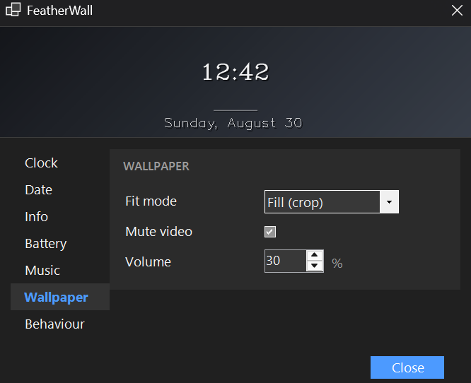 | 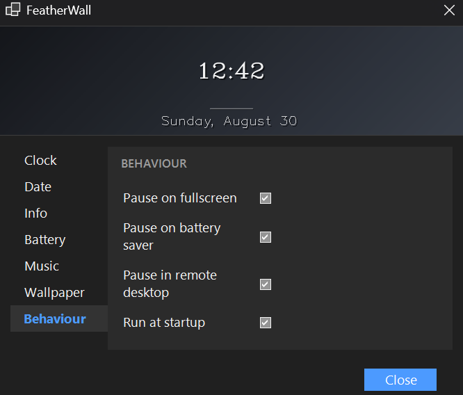 |

| Battery | Music |
|---|---|
| 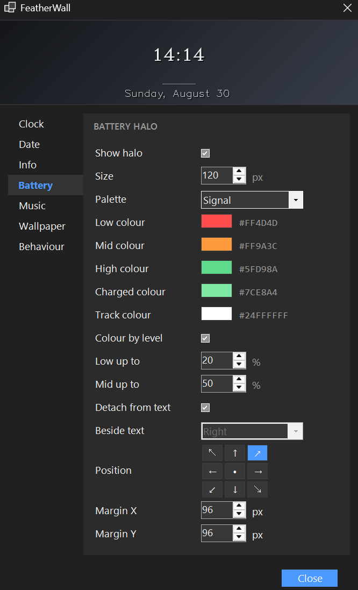 | 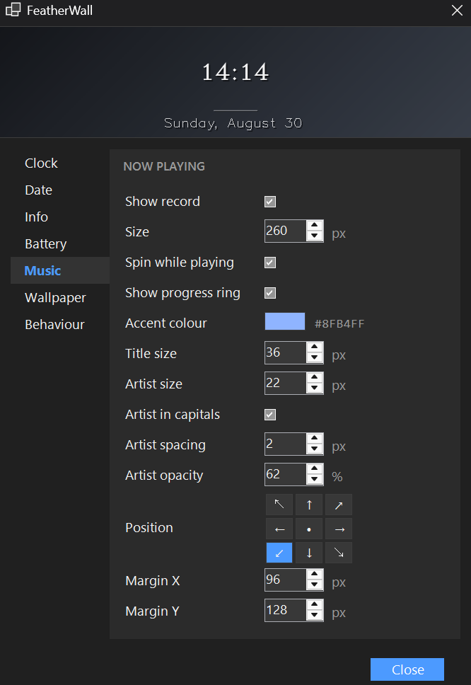 |

### Everything from the tray

<div align="center">

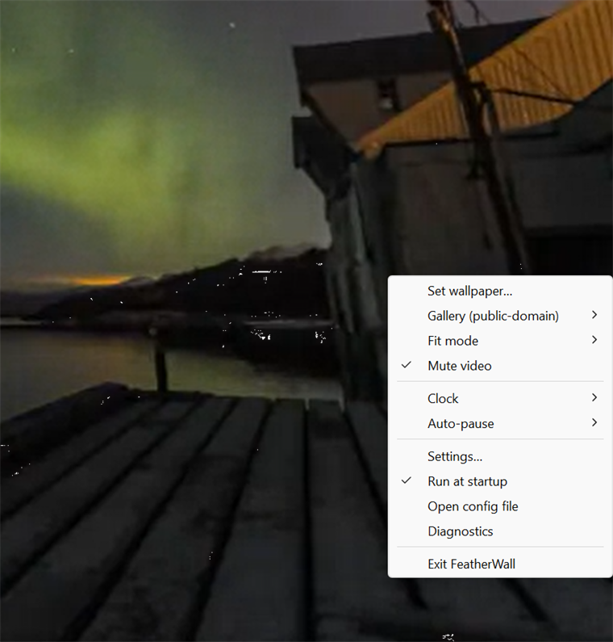

</div>

---

## What it costs you

These are measurements, not estimates. Each row is 25 one-second samples on a running instance,
with the pause state checked before and after the window so a silently paused wallpaper could
never be recorded as a cheap one. The GPU column that used to sit here carried no stated method
and has been fully re-measured; what follows replaces it.

> **Test rig:** Windows 11 Pro 26200 · Intel Core Ultra 9 275HX, 24 logical cores · 63 GB RAM ·
> Intel Arc integrated graphics driving the display, NVIDIA RTX 5090 Laptop idle · 2560x1600 at
> 240 Hz, 150 % scaling · .NET 10 Release build, single monitor.
>
> **Test media, as measured:** the still-image row used `docs/media/hero.jpg`, 1800x1125. The
> 4K60 row used a 3840x2160 H.264 clip at 60 fps and 12 Mbps. Both video rows below were meant to
> be the same clip at two resolutions; only the 4K one has been run through the harness.
>
> The earlier hand-measured table used a 6200x6200 Hubble Ultra Deep Field JPEG and a 1920x1080
> downscale of the video. Those are **not** the files behind the numbers above, which is one more
> reason the two tables should not be compared cell by cell.

| State | CPU (whole machine) | CPU (one core) | Memory (working set) | Graphics memory | Busiest GPU engine |
|---|---|---|---|---|---|
| Still image | 0.008–0.016 % | 0.2–0.4 % | 108–112 MB | 58–62 MB † | 0 % |
| Video, auto-paused | 0.034 % | 0.8 % | 204 MB | 300 MB | 0 % (copy) |
| Video, 1080p60 playing | — | — | — | — | — |
| Video, 4K60 playing | 0.32–0.47 % | 7.6–11.2 % | 189–216 MB | 279–308 MB | 5.8–5.9 % (video decode) |

Every **filled** row is produced by [`scripts/bench/Run-Bench.ps1`](scripts/bench/), which reads
FeatherWall's own log and **refuses to report a row** whose pause state was not the expected one for
the whole sampling window. The 1080p60 row is an intentionally empty placeholder, not a measurement.
The raw records are in [`scripts/bench/results/`](scripts/bench/results/); `docs/benchmark.md`
carries the same numbers with their provenance.

**† The still-image graphics figures are partial** — that run read the GPU counters on 5 of 8
samples, which the record states. Its CPU and memory figures are complete.

**The 1080p60 row is empty because nobody has measured it with the harness.** The 1080p downscale
described above was made for the hand-measured table and is not on this machine, so filling the row
means regenerating that clip and running the harness once. An empty cell here means exactly that,
and never "probably fine".

The first CPU column is the honest one for a 24-core machine. The second is the same measurement
divided by one core instead of twenty-four, because a sub-1 % figure on a machine this wide
deserves the honest denominator next to it.

**Ranges, not points, because CPU moves between runs.** Two full harness runs of the 4K60 row on
the same machine with the same clip measured **0.318 %** and **0.466 %**, and a third measurement
taken straight from `TotalProcessorTime` with no harness involved gave **0.236 %**. Decode cost
tracks scene content and whatever else the machine is doing, so a single run quoted to three
decimals would be false precision — which is the same mistake as the hand-read peak this table
replaced, just a smaller one. The GPU engine figure is stable across runs; CPU is not.

The rows with one measurement show a point value. The auto-paused row is a single run from
2026-08-20, so treat its CPU the same way until it has been repeated.

**Working set grows with uptime.** These rows are measured about twelve seconds after launch, which
is what a script can reproduce. A copy of FeatherWall left running for several hours on this machine
measured **233 MB**. Neither is wrong; they are different questions, and the reproducible one is
published.

**This runs on the integrated GPU, not the discrete one.** Every GPU number above belongs to the
**Intel Arc integrated graphics**. `nvidia-smi` lists no FeatherWall process on the RTX 5090, which
sat at 0 % utilisation and 287 MiB of its 24463 MiB throughout. That is not an accident: the
compositor lives on whichever adapter drives the display, so the wallpaper stays there and never
competes with a game on the discrete card. On a desktop whose only GPU is discrete, these numbers
would land on that card instead.

**Read the GPU column carefully.** Windows reports GPU work per engine, not as one number, and
those percentages do not add up to a total. The table shows the busiest single engine. This adapter
exposes **two** video-decode engines, and adding them together would be meaningless — reporting the
pair as one summed figure would be wrong in a way that looks plausible, which the harness used to do
and was corrected.

A separate 12-sample verification run, taken to check the table's GPU figure against the raw
`\GPU Engine(*)` counters, put the two decode engines at 5.31 % and 5.49 % with 3D at 1.24 %. Those
are a different run from the 5.8 % in the table above, which is why they do not match to the decimal:
each number is the busiest engine averaged across that run's own samples. The agreement that matters
is that both put the work on video decode at around 5–6 %, not on a video-processing engine at 42 %.

**Graphics memory is not the working set.** It is a separate allocation, so add the columns for
the honest total: a 4K60 wallpaper costs roughly **470 MB** of system memory, not 189 MB. An earlier
version of this table listed only the working set, which undersold the real footprint by about
half.

> **Correction, 2026-08-20.** This paragraph used to say dedicated VRAM "reads 0 MB on every row
> because integrated graphics have no memory of their own". That is wrong. The Intel Arc
> integrated GPU on this machine reports 2048 MB of adapter RAM, and Windows attributes **231.6 MB
> of dedicated usage** to FeatherWall on it. The scripted harness in
> [`scripts/bench/`](scripts/bench/) found this on its first real run, which is roughly why it
> exists.
>
> **Re-run, 2026-08-22. The table above is now the scripted one, and the hand-measured figures it
> replaced were substantially wrong.** They read:
>
> | State | CPU (machine) | CPU (one core) | Working set | Graphics | Busiest engine |
> |---|---|---|---|---|---|
> | Still image | 0.06 % | 1.4 % | 156 MB | 44 MB | 0.1 % (3D) |
> | Video, auto-paused | 0.004 % | 0.1 % | 309 MB | 269 MB | 0 % |
> | Video, 1080p60 playing | 0.79 % | 19 % | 212 MB | 122 MB | 29.4 % (video processing) |
> | Video, 4K60 playing | 0.84 % | 20 % | 248 MB | 234 MB | 41.8 % (video processing) |
>
> The 4K60 CPU figure was **2.6× too high** and the GPU figure named an engine that is not busy at
> all. Checked against the raw `\GPU Engine(*)` counters, filtered to FeatherWall's pid, with the
> same clip on the same machine: the busiest engines are two video-decode engines at 5.31 % and
> 5.49 %, with 3D at 1.24 %. **No video-processing engine appears in FeatherWall's counters.** CPU
> was checked the same way, straight from `TotalProcessorTime` over a 30 s window with no harness
> involved: **0.236 %** of the machine, against 0.84 % published. The old numbers were read by hand
> off Task Manager, and a hand-read peak is not an average.
>
> The paused row's CPU moved the other way — 0.034 % rather than 0.004 % — so this is not a
> correction that only ever flatters the project.
>
> Working set is the one figure the old table got closest to: 248 MB against 189 MB measured twelve
> seconds after launch, because it was read from a long-running copy. That difference is uptime, not
> error, and is stated above the table now.

**Frame rate is a dial as well as resolution.** The 1080p and 24 fps comparisons that used to sit
here were built on the hand-measured numbers above, so they have been removed rather than rescaled
— the shape of the claim may well survive a re-measurement, but it has not had one, and a
plausible number is not a measured one. Re-run the harness with a 1080p clip and a 24 fps clip to
put it back on evidence.

**Pausing costs nothing to run, but it does not give the memory back.** Put a fullscreen app in
front, lock the session, connect over RDP or switch on battery saver, and playback stops rather
than throttling: 0.034 % CPU and no video engine activity at all. The buffers stay allocated so
resuming is instant, which makes paused the highest-memory row in the table. That is the honest
shape of it, and it is the state the wallpaper is in whenever you are actually gaming.

It also stays where it starts. Memory and threads were flat across 30 consecutive full re-applies,
which is the path a laptop hits every time it docks or changes monitors: 250 MB to 278 MB, 56
threads to 63. That used to go very differently, and the [honest notes](#honest-notes) below
explain what changed.

<sub>On battery specifically: system draw sat at 31 to 33 W across all three states on this laptop, which is within noise for isolating a single process. FeatherWall's share is not separable from that, so there is no watts figure here. The pause behaviour above is the honest version of that claim.</sub>

---

## Why this exists

Wallpaper engines have a habit of being enormous. Several processes, mixed runtimes, an embedded
browser to draw a looping MP4, a launcher, an account, a storefront. Then Windows 11 24H2 changed
how the desktop is composed and a lot of them started painting black rectangles.

FeatherWall is the other bet.

One process and one runtime. Raw Win32, Direct3D 11 and DirectComposition, with WinRT MediaPlayer
in frame-server mode for decoding. No WPF, no WinUI, no WebView2, no CEF, no player subprocess.
`featherwall.exe` is the entire application.

It is built for the current Windows desktop. FeatherWall detects and supports both desktop
topologies, the classic `WorkerW` layout and the Windows 11 24H2+ raised desktop where Progman
opts out of GDI redirection, and it renders through DirectComposition, the same path the shell
itself uses. [`docs/architecture.md`](docs/architecture.md) covers that properly and is the most
interesting file in the repository.

There is no account, no telemetry and no network traffic unless you ask for it. The only time
FeatherWall reaches the internet is when you click a gallery item to download it.

---

## Install

Windows 10 1809 or newer. Grab the release, or build it yourself.

### Download

Take `featherwall-v0.2.0-win-x64.zip` from the
[latest release](https://github.com/RitvikDayal/featherwall/releases/latest). It unzips to a
single `featherwall.exe`, so there is no installer and nothing to uninstall. Run it and you are
done.

You need the [.NET 10 desktop runtime](https://dotnet.microsoft.com/download/dotnet/10.0), which
is a much smaller download than the SDK. Keeping the build framework-dependent is what holds the
release to 7 MB instead of shipping a copy of .NET with it.

Verify the download if you like:

```powershell
Get-FileHash .\featherwall-v0.2.0-win-x64.zip -Algorithm SHA256
# 300f59a28269fc2fc034ad86ee64d6fd320cd17f8c2e7a31c789bcc28844dfd7
```

### Or build from source

This needs the [.NET 10 SDK](https://dotnet.microsoft.com/download) rather than just the runtime.

```powershell
git clone https://github.com/RitvikDayal/featherwall
cd featherwall
dotnet build -c Release
.\src\FeatherWall\bin\Release\net10.0-windows10.0.19041.0\featherwall.exe
```

### Then

A feather appears in your tray. Right-click it and pick **Set wallpaper** for your own file, or
**Gallery** to pull something public domain. Double-click the tray icon for the settings panel.

| Flag | Does |
|---|---|
| `--settings` | Opens the settings panel |
| `--diag` | Prints the detected desktop topology and monitor layout |
| `--exit` | Stops the running instance |

> Releases are unsigned today, and a program that reaches into shell windows is exactly the shape
> security heuristics dislike. Build from source, or choose *More info* then *Run anyway*. Code
> signing through SignPath Foundation is on the roadmap.

---

## Features

Video wallpapers in MP4 and H.264 out of the box, plus MOV, AVI, WMV and WebM. Looping happens
inside the media pipeline so there is no seam, and playback is muted by default and hardware
decoded. Images cover PNG, JPEG, BMP, TIFF and animated GIF.

The clock is the part people notice. Large light-weight time, a hairline rule, a small dimmed
date underneath. It takes any installed font at any size, sits at any of nine anchors, does 12 or
24 hour with optional seconds, and has adjustable colour, opacity and shadow. It is click-through
by construction, so it never gets in the way of your desktop icons.

The date has its own settings page: its own font, its own size as a percentage of the time, its
own colour and opacity, or it can inherit any of those from the time. On a multi-monitor setup
with mixed scaling, the clock is sized per display, so it stays the same physical size on a 100%
external as it is on a 150% laptop panel.

The info widget is a second, separately anchored block fed by the system, **off by default** —
turning it on is one checkbox on the Info page.

The **battery halo** is a ring with the charge inside it: the arc is the level, the colour steps
with it — red low, orange middling, green when healthy — and a bolt sits beside the number while
charging, replaced by a tick when it is full. Three palette presets and five colour pickers,
adjustable thresholds and size. It sits beside the text or detaches entirely and takes its own
anchor anywhere on screen.

The **now-playing record** shows what you are listening to as a vinyl record, with the *real album
artwork* on its label — read from the same Windows media session everything else here uses, so
there is still no network call. It turns at 33⅓ rpm while something plays, with the track's
progress on the rim. Nothing playing means no record; a track with no artwork gets a flat disc in
the accent colour rather than a broken box; pausing dims it rather than emptying it.

**The record is the one thing in FeatherWall that runs on a frame clock**, and it is deliberately
hard to leave running: it turns only while something is actually playing *and* the desktop is
uncovered *and* the display is on. Any of those going false stops it dead — not throttled, stopped.
Turning off "Spin while playing" leaves its timer permanently disarmed, and you keep the record,
the artwork and the progress ring as a still image. The battery and now-playing sources repaint
only when Windows pushes an event — a battery percentage moving, a track changing — and the clock
ticks once a second, as it has since v0.1.0.

Everything else: per-monitor wallpapers, Fill, Fit and Stretch modes, DPI-aware rendering, a full
tray menu, JSON config for anything the UI does not expose, and auto-pause on fullscreen apps,
session lock, remote desktop and battery saver. If explorer.exe restarts or the shell rebuilds the
wallpaper layer, FeatherWall re-attaches itself, and it puts your original wallpaper back when it
exits.

---

## The gallery is deliberately boring

Pexels, Unsplash and Pixabay all explicitly prohibit wallpaper apps in their terms, so FeatherWall
does not touch them. The gallery is a static manifest of genuinely public domain and CC0 media
from NASA and Wikimedia Commons, downloaded straight from the source when you click it. No API
key, no backend, no grey area.

8 of the 11 entries carry a SHA-1 that gets verified after download, and a mismatch is a hard
failure. The other three, all NASA-hosted videos, are unpinned today and download without
verification. That is [issue #1](https://github.com/RitvikDayal/featherwall/issues/1) and it is a
good first contribution.

---

## Configuration

The tray menu and settings panel cover the common cases. Everything lives in
`%APPDATA%\FeatherWall\config.json`:

```json
{
  "wallpapers": [{ "monitor": "*", "path": "C:\\wallpapers\\aurora.webm" }],
  "fit": "Fill",
  "muteVideo": true,
  "volume": 0.3,
  "clock": {
    "enabled": true,
    "anchor": "TopCenter",
    "marginX": 48,
    "marginY": 96,
    "twentyFourHour": true,
    "showSeconds": false,
    "showDate": true,
    "separator": true,
    "fontSize": 150,
    "fontFamily": "Segoe UI Light",
    "color": "#F0FFFFFF",
    "shadow": true,

    "dateFontFamily": "Segoe UI",
    "dateFontScale": 0.16,
    "dateMinFontSize": 11,
    "dateColor": null,
    "dateOpacity": 0.8,

    "marginTop": null,
    "marginRight": null,
    "marginBottom": null,
    "marginLeft": null
  },
  "info": {
    "enabled": false,
    "anchor": "BottomLeft",
    "marginX": 48,
    "marginY": 48,
    "fontSize": 22,
    "fontFamily": "Segoe UI",
    "color": "#C0FFFFFF",
    "shadow": true,
    "maxCharacters": 48,
    "sources": ["nowPlaying", "battery"],

    "halo": {
      "enabled": true,
      "size": 44,
      "detached": false,
      "placement": "Left",
      "anchor": "TopRight",
      "colorByLevel": true,
      "lowColor": "#FF4D4D",  "lowThreshold": 20,
      "midColor": "#FF9A3C",  "midThreshold": 50,
      "highColor": "#5FD98A",
      "chargedColor": "#7CE8A4",
      "trackColor": "#24FFFFFF"
    },

    "disc": {
      "enabled": true,
      "size": 112,
      "rotate": true,
      "showProgress": true,
      "accentColor": "#8FB4FF",
      "anchor": "BottomLeft",
      "titleFontSize": 19,
      "artistFontSize": 14,
      "artistUppercase": true,
      "artistLetterSpacing": 1.4,
      "artistOpacity": 0.62
    }
  },
  "pause": { "onFullscreen": true, "onBatterySaver": true, "onRemoteSession": true }
}
```

`sources` is ordered, and the order is the display order. A name this version does not know is
logged and skipped rather than refused, so a config written by a later one still starts. Long
titles are truncated at `maxCharacters` rather than scrolled — scrolling means animating, and
animating means waking up.

`monitor` takes a device name such as `\\.\DISPLAY1`, or `"*"` for all of them. Logs are written to
`%LOCALAPPDATA%\FeatherWall\featherwall.log`.

An empty `dateFontFamily` inherits the time's face; a null `dateColor` inherits the time's colour
dimmed by `dateOpacity`. The four per-edge margins each fall back to `marginX` or `marginY` when
null, and only the edges your chosen anchor actually touches are used. Every default above
reproduces the v0.1.0 rendering exactly, so upgrading changes nothing until you set one.

FeatherWall decodes through the OS media pipeline, so H.264 and MP4 work everywhere. HEVC needs
the paid HEVC Video Extensions, and VP9 and AV1 need the free extensions from the Microsoft Store.
Gallery entries are labelled when they need one.

---

## Honest notes

Things that are true and worth saying out loud.

CPU while a 4K60 video plays is **0.3 % to 0.5 %** of the machine, which is 8 % to 11 % of a single
core, and it moves between runs.
That is the cost of copying every decoded frame onto the composition surface and presenting it, and
it is not zero. A still image is effectively free at 0.008 %, and auto-pause means the video is not
running most of the time anyway, but the number is the number.

This paragraph said "about 1 % of the machine, about 24 % of a single core" until 2026-08-22. That
came from the hand-measured table, which the scripted harness has since shown was roughly 2.6× too
high. The correction makes the project look better, which is exactly the direction that deserves the
most scepticism — so the measurement is reproducible by anyone with the repo and one command, and
the raw record is committed.

The re-apply leak is fixed, and it was bad. Until recently every full re-apply, which includes
display changes, monitor hot-plug and explorer restarts, stranded roughly 27 threads and 24 MB
permanently. A disposed WinRT `MediaPlayer` holds onto its Media Foundation worker threads until
the runtime collects it, because projected child objects keep COM references that the player's own
`Dispose` cannot release. A laptop that docked a few times a day would drift past 500 MB and 129
threads. The pipeline is now reclaimed explicitly at teardown, and 30 back-to-back re-applies move
memory by under 30 MB.

Quitting used to hang. `SystemParametersInfo(SPI_SETDESKWALLPAPER)` with `SPIF_SENDCHANGE`
broadcasts to every top-level window and waits for each one to answer, and it was running on the UI
thread during shutdown. One busy application that was not pumping messages and `featherwall.exe`
would never exit. It now writes the setting without the blocking broadcast and notifies other
applications asynchronously.

Some things have not been verified on real hardware: multi-monitor layouts, the classic `WorkerW`
topology (the development machine is a 24H2+ raised desktop), and recovery from an explorer.exe
restart. Those code paths exist and are unit-tested where unit tests can reach, but nobody has
exercised them on hardware yet. If you have a second monitor or a Windows 10 machine, that is the
single most useful thing you could contribute.

---

## Contributing

Contributions are welcome, and there is a fair amount of low-hanging fruit. Start with the
[good first issue](https://github.com/RitvikDayal/featherwall/labels/good%20first%20issue) label,
or the [help wanted](https://github.com/RitvikDayal/featherwall/labels/help%20wanted) label if you
have hardware this project does not.

[CONTRIBUTING.md](CONTRIBUTING.md) has the ground rules. The short version: `dotnet test` should be
green before you open a pull request, which takes under a second for the 126 tests currently in the
suite, and anything touching interop or rendering needs to say which desktop topology you tested
it on. Please also read the [Code of Conduct](CODE_OF_CONDUCT.md).

If you have hardware this project does not — a second monitor, a mixed-DPI setup, or a Windows 10
machine — the most useful thing you can do is fill in a row of
[`docs/recovery-matrix.md`](docs/recovery-matrix.md). `featherwall --diag` prints most of what a
result needs.

Security issues go through [SECURITY.md](SECURITY.md) rather than the public tracker.

## Roadmap

Slideshows and playlists, more widgets such as battery and now-playing, and a drag-to-position
edit mode for the clock. On the engine side: an `IMFMediaEngine` backend, NativeAOT single-file
publishing, and an optional mpv backend for codecs Media Foundation will not touch. On the release
side: a winget package, signed builds and an ARM64 CI leg.

## License

[MIT](LICENSE). Gallery media is public domain or CC0 and documented per entry in
[THIRD-PARTY-NOTICES.md](THIRD-PARTY-NOTICES.md).
