<div align="center">

# PrismOS

### Live wallpapers for Windows that don't eat your laptop.

Any video or image on your desktop, with clock, battery and music widgets in seven styles.
One process. No browser engine, no launcher, no account.

[](https://github.com/YUouriii/PrismOS/stargazers)
[](https://github.com/YUouriii/PrismOS/releases)
[](#install)
[](https://github.com/YUouriii/PrismOS/actions/workflows/ci.yml)
[](LICENSE)

**[Website](https://yuouriii.github.io/PrismOS/)** · **[Download](https://github.com/YUouriii/PrismOS/releases/latest)** · **[Architecture](docs/architecture.md)**

</div>

> **PrismOS is a fork of [FeatherWall](https://github.com/RitvikDayal/featherwall) by
> [Ritvik Dayal](https://github.com/RitvikDayal)**, used under the MIT licence. The original work
> is the basis everything here started from; this fork renames the app and works on what comes
> next. See [THIRD-PARTY-NOTICES.md](THIRD-PARTY-NOTICES.md) and [LICENSE](LICENSE).

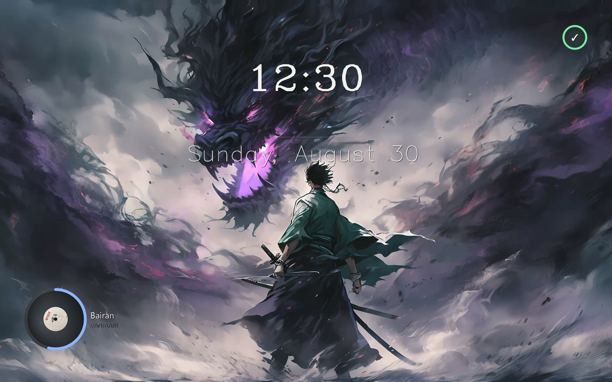

<sub>Wallpaper: <i>Samurai Boss Fight Fantasy Dragon</i>, via <a href="https://moewalls.com/fantasy/samurai-boss-fight-fantasy-dragon-live-wallpaper/">MoeWalls</a>, shown with credit; see <a href="THIRD-PARTY-NOTICES.md#widget-style-samples">THIRD-PARTY-NOTICES.md</a>.</sub>

## Install

```powershell
winget install YUouriii.PrismOS
```

Windows 10 1809 or newer, plus the [.NET 10 desktop runtime](https://dotnet.microsoft.com/download/dotnet/10.0).
It installs per user without admin rights. `winget upgrade YUouriii.PrismOS` keeps it current.

**Or the installer.** Download [`PrismOS-Setup.exe`](https://github.com/YUouriii/PrismOS/releases/latest/download/PrismOS-Setup.exe) and run it.
It installs for your user, adds PrismOS to the Start menu, and uninstalls from Apps & Features.
If the .NET 10 desktop runtime is missing it installs that first, which asks for admin. It is
unsigned, so SmartScreen will warn: choose More info, then Run anyway.

<details>
<summary><b>Or take the ZIP, or build it yourself</b></summary>

**ZIP.** Download `prismos-v0.3.2-win-x64.zip` from the
[latest release](https://github.com/YUouriii/PrismOS/releases/latest). It unzips to a single
`prismos.exe`, so there is no installer. The first run adds PrismOS to your Start menu;
delete that entry and it stays deleted. To uninstall, turn off "Run at startup", quit from the
tray, then delete the folder and the Start menu entry. Check the download if you like:

```powershell
Get-FileHash .\prismos-v0.3.2-win-x64.zip -Algorithm SHA256
# 1ccd202f5358aa5c8175e32225ec18fd7ac5c355d70d4fe0afca1b39239645e6
```

The build is framework-dependent, which keeps the release at 7 MB instead of shipping .NET with it.

**From source.** Needs the [.NET 10 SDK](https://dotnet.microsoft.com/download).

```powershell
git clone https://github.com/YUouriii/PrismOS
cd prismos
dotnet build -c Release
.\src\PrismOS\bin\Release\net10.0-windows10.0.19041.0\prismos.exe
```

</details>

The PrismOS mark appears in your tray. Clicking it (or the **PrismOS** Start menu entry) opens
the app with everything: wallpaper, gallery, clock, widgets, colours and behaviour — the window is
the whole control panel, and there is nothing hidden in a menu. Right-clicking the tray icon gives
you three items: **Open PrismOS**, **Refresh** (re-apply wallpaper and widgets) and **Exit PrismOS**.

| Flag | Does |
|---|---|
| `--silent` | Starts without opening the window — used for startup with Windows |
| `--settings` | Opens the settings panel |
| `--diag` | Prints the detected desktop topology and monitor layout |
| `--exit` | Stops the running instance |
| `--no-shortcut` | Leaves the Start menu entry alone, for a development build |

> Releases are unsigned, so SmartScreen may warn: choose *More info*, then *Run anyway*, or build
> from source. Code signing through SignPath Foundation is on the roadmap.

## Seven widget styles

Pick one on the **Style page** in settings. The accent comes from your wallpaper,
or you choose it. Size goes from 50 to 300%.

| Classic | Editorial | Glass dock |
|---|---|---|
| 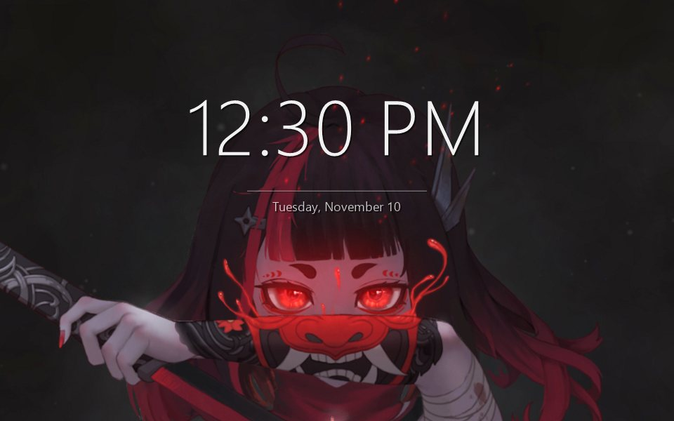 | 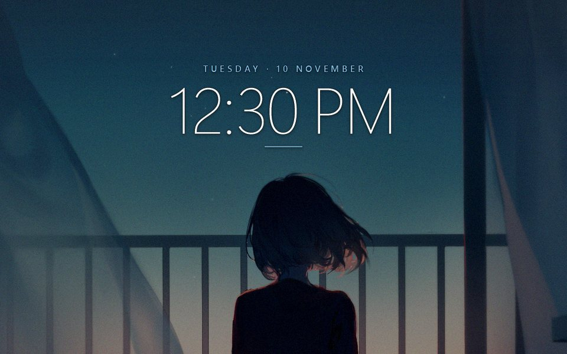 | 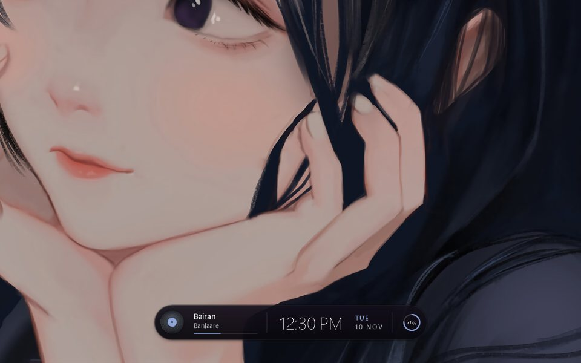 |
| The original look. Upgrading keeps it. | A light clock under small accent capitals. | Record, time and battery in one capsule. |

| Orbit | Poster |
|---|---|
| 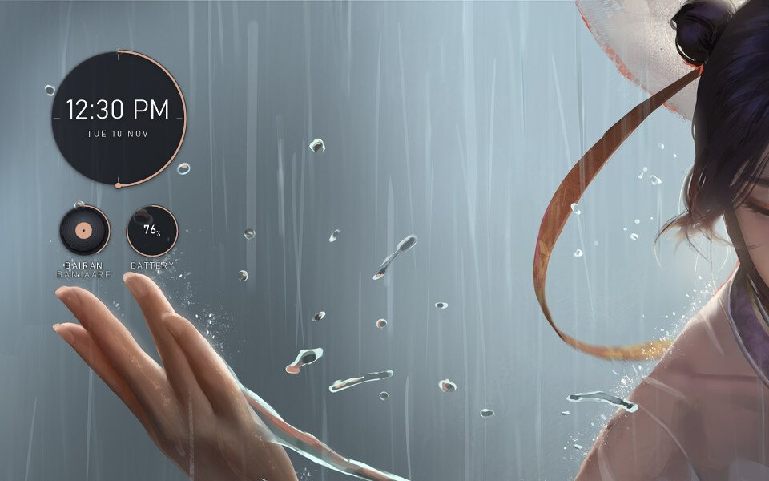 | 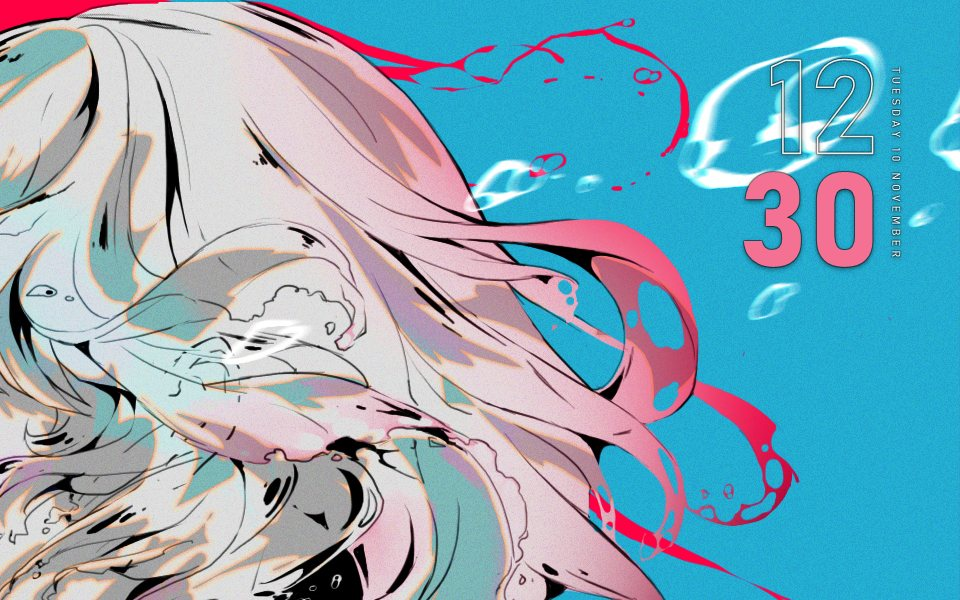 |
| Everything is a ring. The dial fills as the hour passes. | A big stacked clock: outlined hours, accent minutes. |

| Monolith | Tiles |
|---|---|
| 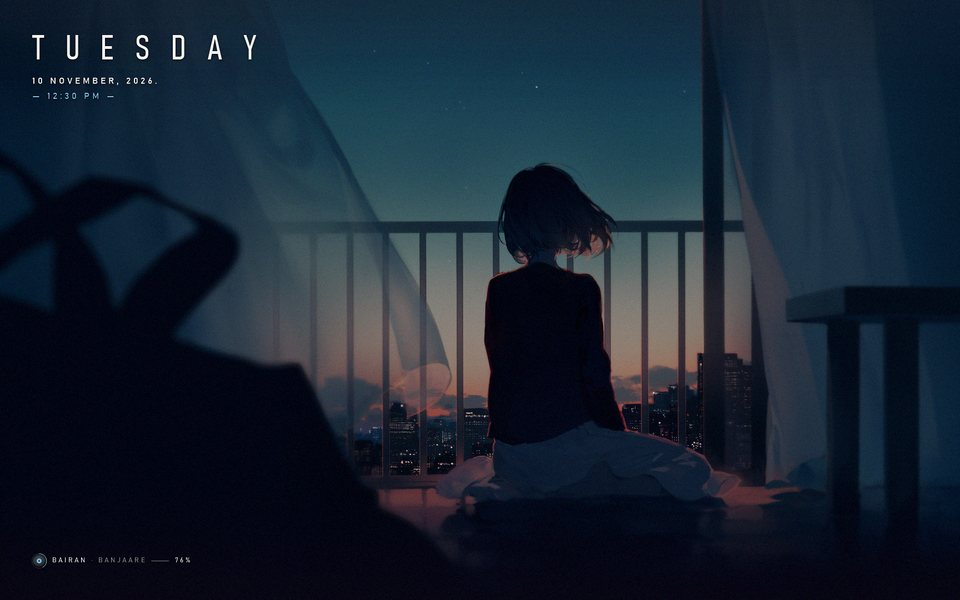 | 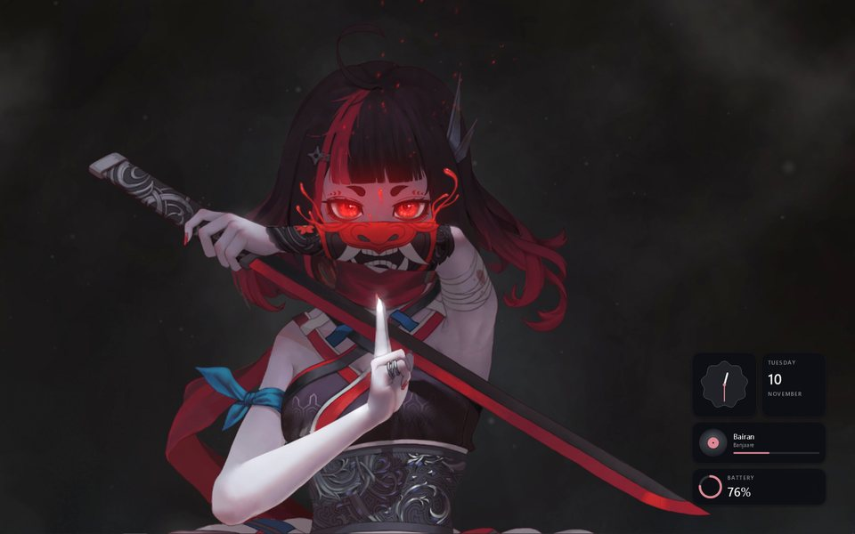 |
| The weekday in wide thin capitals; music and battery on one line. | Rounded cards: analog clock, date, record, battery ring. |

<sub>Drawn by PrismOS's own renderers over wallpapers by other artists, used with credit; see <a href="THIRD-PARTY-NOTICES.md#widget-style-samples">THIRD-PARTY-NOTICES.md</a>. Live versions are on the <a href="https://yuouriii.github.io/PrismOS/">website</a>.</sub>

## What it does

**Video wallpapers**, playing live on the desktop while it stays fully usable.

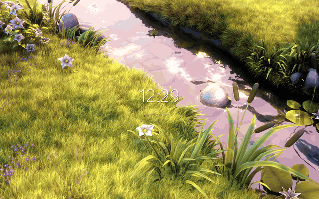

<sub>A real screen recording of a 4000x2250 clip. <i>Big Buck Bunny</i>, (c) copyright 2008 Blender Foundation, <a href="https://peach.blender.org">peach.blender.org</a>, <a href="https://creativecommons.org/licenses/by/3.0/">CC BY 3.0</a>.</sub>

**A music pill for whatever you're playing.** Real album art from the Windows media session with the
source app it came from, animated equalizer bars, and working previous / play-pause / next buttons —
clickable, driving the player through the Windows media session. Any app with media controls counts,
browser tabs included. The bars move only while something is actually playing; they stop with the
desktop covered or the display off.

<div align="center">

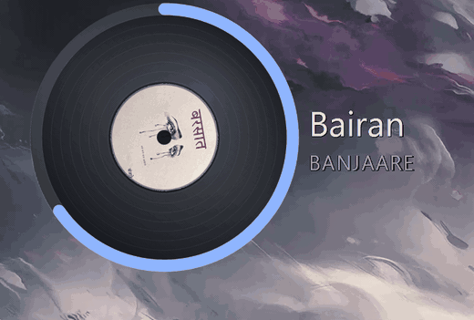

</div>

**A battery halo.** The arc is the charge: red to 20%, orange to 50%, green above. A bolt while
charging, a tick when full.

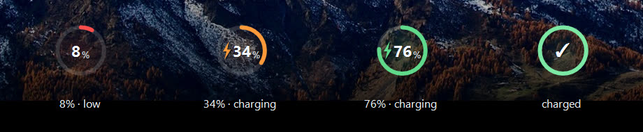

<sub>Four states drawn by the real renderer and set side by side; a laptop is only ever in one.</sub>

**A clock in any font you own**, at nine positions, with optional seconds, date and rule.

| Bahnschrift Light, bottom left, with seconds | Cascadia Mono, top right |
|---|---|
| 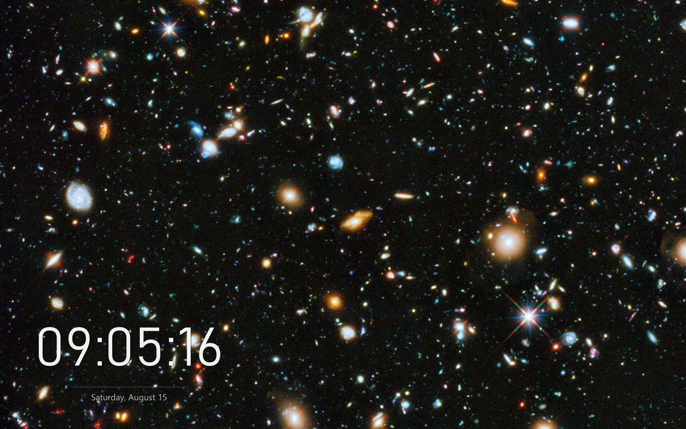 | 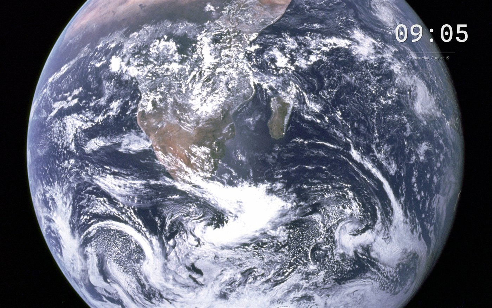 |

<sub>Hubble Ultra Deep Field (NASA and ESA, public domain). <i>The Earth seen from Apollo 17</i> (NASA, public domain). Full credits in <a href="THIRD-PARTY-NOTICES.md">THIRD-PARTY-NOTICES.md</a>.</sub>

**Settings that apply while you watch.** The panel's live preview uses the same renderer as your
desktop, so it can't drift from the real thing.

| Clock | Battery | Music |
|---|---|---|
| 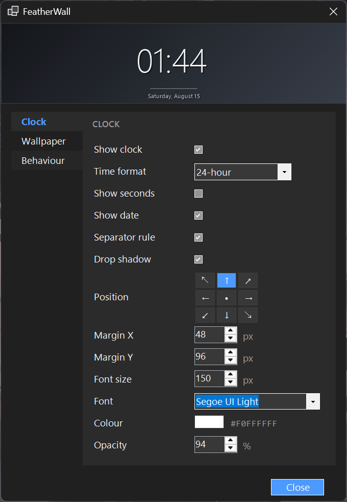 | 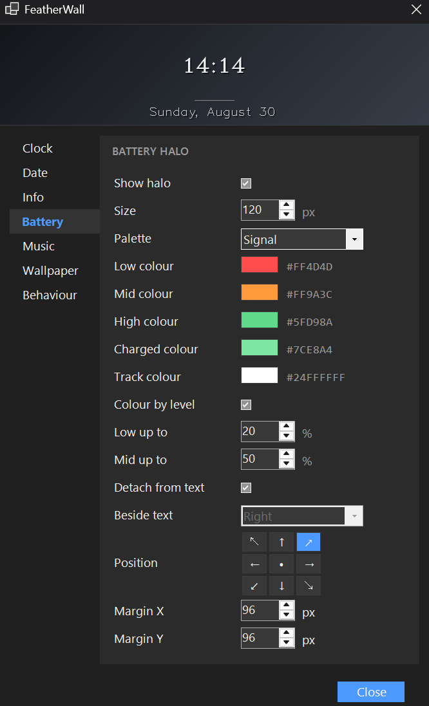 | 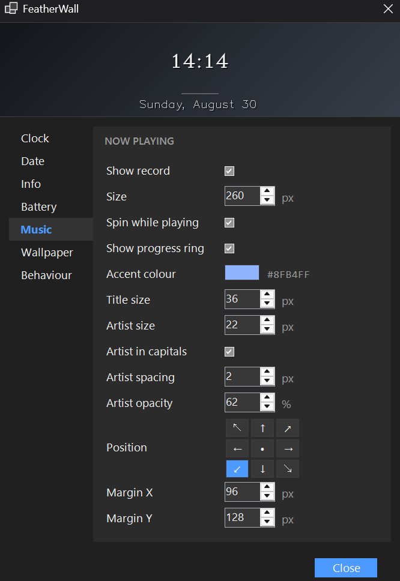 |

**The wallpaper page shows what is actually on your screen.** It previews the wallpaper on the
display you pick — an image shows itself, a video **plays live and looped inside the panel**, through
a software (CPU-only) Media Foundation decode that deliberately never touches the GPU, so the
NVIDIA App overlay stays quiet — and lets you change it from
there: browse for a file, or open the gallery as a list with each wallpaper's resolution,
size and licence. A wallpaper can be applied to one display or to all of them, so a second screen
does not have to show the same thing as the first. A Behaviour toggle turns the live preview off
and shows the captured still instead.

**One colour picker for the whole app.** A saturation/value square, a hue ramp and an opacity ramp
over a chequerboard, a hex field, the four channels as numbers, and a preview of the colour next to
the one you started with. The Windows colour dialog it replaces could not express alpha at all,
which is why every colour had an opacity spinner beside it.

**An About page** with the version, where the project came from, and a check for a newer release.
The check asks GitHub — it needs no account and downloads nothing. If it cannot be reached, it
says so; it never reports "up to date" for a check that did not run.

**Reset to defaults** on the Behaviour page puts every setting back to how PrismOS ships, with a
confirmation that says what goes and what survives: your wallpapers are kept, and so is the
wallpaper PrismOS will put back when it exits.

Also: MP4, MOV, AVI, WMV and WebM video with seamless, hardware-decoded loops; PNG, JPEG, BMP, TIFF
and animated GIF images; per-monitor wallpapers; Fill, Fit and Stretch; DPI-aware sizing on mixed
displays. It re-attaches if explorer.exe restarts and puts your old wallpaper back when it exits.

## What it costs

Measured by [`scripts/bench/Run-Bench.ps1`](scripts/bench/), which refuses any row whose pause
state changed during the sampling window. Full method, raw records and every correction:
[`docs/benchmark.md`](docs/benchmark.md).

| State | CPU (whole machine) | CPU (one core) | Memory (working set) | Graphics memory | Busiest GPU engine |
|---|---|---|---|---|---|
| Still image | 0.008–0.016 % | 0.2–0.4 % | 108–112 MB | 58–62 MB † | 0 % |
| Video, auto-paused | 0.034 % | 0.8 % | 204 MB | 300 MB | 0 % (copy) |
| Video, 1080p60 playing | — | — | — | — | — |
| Video, 4K60 playing | 0.32–0.47 % | 7.6–11.2 % | 189–216 MB | 279–308 MB | 5.8–5.9 % (video decode) |

<sub>Windows 11, Intel Core Ultra 9 275HX, Intel Arc integrated graphics driving a 2560x1600 display at 240 Hz, RTX 5090 Laptop idle. A dash means nobody has measured it. † Read on 5 of 8 samples.</sub>

- **It stays on the integrated GPU.** The compositor uses whichever adapter drives your display, and
  `nvidia-smi` shows nothing on the RTX 5090. Your games keep the big GPU.
- **Paused means stopped.** Fullscreen apps, the lock screen, remote sessions and battery saver stop
  playback outright. Memory stays allocated so resuming is instant.
- **Only the music pill animates.** Equalizer bars stop when playback stops, the desktop is covered
  or the display sleeps; everything else redraws on a Windows event.
- **Add the memory columns** for the real footprint: about 470 MB for 4K60.
- **CPU varies between runs**, so the table shows ranges. Treat any single figure as one sample.

## Why this exists

Wallpaper engines tend to be enormous: several processes, an embedded browser to loop an MP4, a
launcher, an account, a storefront. Then Windows 11 24H2 changed how the desktop is composed, and
many of them started painting black rectangles.

PrismOS is one process on raw Win32, Direct3D 11 and DirectComposition, with WinRT MediaPlayer
decoding frames. It supports both desktop layouts, the classic `WorkerW` one and the 24H2 raised
desktop, and renders the way the shell itself does. [`docs/architecture.md`](docs/architecture.md)
explains how.

No account, no telemetry. It only goes online when you download something from the gallery.

## The gallery is deliberately boring

Pexels, Unsplash and Pixabay forbid wallpaper apps in their terms, so the gallery is a static list
of public domain and CC0 media from NASA and Wikimedia Commons, downloaded straight from the source.
8 of the 11 entries are checked against a SHA-1 after download; the 3 NASA videos are not yet
([issue #1](https://github.com/YUouriii/PrismOS/issues/1), a good first contribution).

## Configuration

The settings panel covers the common cases. Everything lives in
`%APPDATA%\PrismOS\config.json`, and logs go to `%LOCALAPPDATA%\PrismOS\prismos.log`.

<details>
<summary><b>The full config, with defaults</b></summary>

```json
{
  "wallpapers": [{ "monitor": "*", "path": "C:\\wallpapers\\aurora.webm" }],
  "fit": "Fill",
  "muteVideo": true,
  "volume": 0.3,
  "clock": {
    "enabled": true,
    "anchor": "TopCenter",
    "marginX": 48,
    "marginY": 96,
    "twentyFourHour": true,
    "showSeconds": false,
    "showDate": true,
    "separator": true,
    "fontSize": 150,
    "fontFamily": "Segoe UI Light",
    "color": "#F0FFFFFF",
    "shadow": true,

    "dateFontFamily": "Segoe UI",
    "dateFontScale": 0.16,
    "dateMinFontSize": 11,
    "dateColor": null,
    "dateOpacity": 0.8,

    "marginTop": null,
    "marginRight": null,
    "marginBottom": null,
    "marginLeft": null
  },
  "info": {
    "enabled": false,
    "anchor": "BottomLeft",
    "marginX": 48,
    "marginY": 48,
    "fontSize": 22,
    "fontFamily": "Segoe UI",
    "color": "#C0FFFFFF",
    "shadow": true,
    "maxCharacters": 48,
    "sources": ["nowPlaying", "battery"],

    "halo": {
      "enabled": true,
      "size": 44,
      "detached": false,
      "placement": "Left",
      "anchor": "TopRight",
      "colorByLevel": true,
      "lowColor": "#FF4D4D",  "lowThreshold": 20,
      "midColor": "#FF9A3C",  "midThreshold": 50,
      "highColor": "#5FD98A",
      "chargedColor": "#7CE8A4",
      "trackColor": "#24FFFFFF"
    },

    "disc": {
      "enabled": true,
      "size": 112,
      "rotate": true,
      "showProgress": true,
      "accentColor": "#8FB4FF",
      "anchor": "BottomLeft",
      "titleFontSize": 19,
      "artistFontSize": 14,
      "artistUppercase": true,
      "artistLetterSpacing": 1.4,
      "artistOpacity": 0.62
    }
  },
  "pause": { "onFullscreen": true, "onBatterySaver": true, "onRemoteSession": true },
  "widgets": { "theme": "classic", "accent": "auto", "size": null, "position": null, "monitor": "*", "themesNoticeShown": false },
  "startMenuShortcutAdded": true
}
```

`widgets` sets the style:

| Key | Values | |
|---|---|---|
| `theme` | `classic`, `editorial`, `glassDock`, `orbit`, `poster`, `monolith`, `tiles` | An upgrade keeps `classic`; a fresh install starts on `orbit`. An unknown name falls back to `classic`. |
| `accent` | `auto` or `#RRGGBB` | Used by every style but Classic. `auto` samples it once from the wallpaper. |
| `size` | 50–300, or `null` | Percentage size for every style but Classic. `null` follows `clock.fontSize` against its 110 px default. |
| `position` | an anchor, or `null` | Where Glass dock, Orbit, Poster, Monolith and Tiles place the set. Glass dock reads only top or bottom. |
| `monitor` | a device name, or `*` | The monitor those five draw on; `*` is the primary. |
| `themesNoticeShown` | `true`/`false` | Set once the one-time "new widget styles" notice has shown. |

Classic and Editorial keep each widget's own position, monitor and margins. The other five place
the whole set from `position` and `monitor`.

- `startMenuShortcutAdded` keeps a deleted Start menu entry deleted. Set it to `false` to get the entry back.
- `sources` is ordered, and the order is the display order. An unknown name is logged and skipped, so a config from a later version still starts. Long titles are cut at `maxCharacters` rather than scrolled, because scrolling would mean animating.
- `monitor` takes a device name such as `\\.\DISPLAY1`, or `"*"` for all of them.
- An empty `dateFontFamily` inherits the time's face, and a null `dateColor` inherits its colour dimmed by `dateOpacity`. Each per-edge margin falls back to `marginX` or `marginY` when null.
- Every default reproduces the v0.1.0 rendering, so upgrading changes nothing until you set one.

H.264 and MP4 work everywhere. HEVC needs the paid HEVC Video Extensions; VP9 and AV1 need the free
extensions from the Microsoft Store. Gallery entries say when they need one.

</details>

## Honest notes

- **4K60 video costs 0.3 % to 0.5 % of the machine** (8 % to 11 % of one core), from copying every
  decoded frame onto the desktop. A still image costs 0.008 %. Until 2026-08-22 this said about 1 %;
  the scripted harness showed the hand-read figure was 2.6× too high, and the raw record is committed.
- **A re-apply leak is fixed.** Every display change, hot-plug or explorer restart used to strand
  about 27 threads and 24 MB, because a disposed WinRT `MediaPlayer` kept its Media Foundation
  threads alive; a laptop that docked a few times a day drifted past 500 MB and 129 threads. The
  pipeline is now reclaimed explicitly; 30 re-applies in a row move memory by
  under 30 MB.
- **Quitting no longer hangs.** Restoring the wallpaper used to broadcast to every window and wait
  on the UI thread, so one unresponsive app could block exit. It now writes the setting without
  the blocking broadcast.
- **Not yet verified on real hardware:** multi-monitor layouts, the classic `WorkerW` desktop
  (the development machine runs 24H2) and recovery from an explorer.exe restart. They are
  unit-tested where unit tests reach. If you have a
  second monitor or a Windows 10 machine, that is the most useful thing you could test.

## Contributing

Start with [good first issue](https://github.com/YUouriii/PrismOS/labels/good%20first%20issue)
or, if you have hardware this project lacks,
[help wanted](https://github.com/YUouriii/PrismOS/labels/help%20wanted). A filled-in row of
[`docs/recovery-matrix.md`](docs/recovery-matrix.md) is especially welcome; `prismos --diag`
prints most of what it needs.

[CONTRIBUTING.md](CONTRIBUTING.md) has the rules: `dotnet test` green before a pull request, and
anything touching interop or rendering says which desktop layout you tested on. Please read the
[Code of Conduct](CODE_OF_CONDUCT.md). Security issues go through [SECURITY.md](SECURITY.md).

## Roadmap

Slideshows and playlists, and a drag-to-position edit mode for the widgets. On the engine side: an
`IMFMediaEngine` backend, NativeAOT single-file publishing, and an optional mpv backend for codecs
Media Foundation won't touch. On the release side: signed builds and an ARM64 CI leg.

## License

[MIT](LICENSE). Gallery media is public domain or CC0, documented per entry in
[THIRD-PARTY-NOTICES.md](THIRD-PARTY-NOTICES.md).
