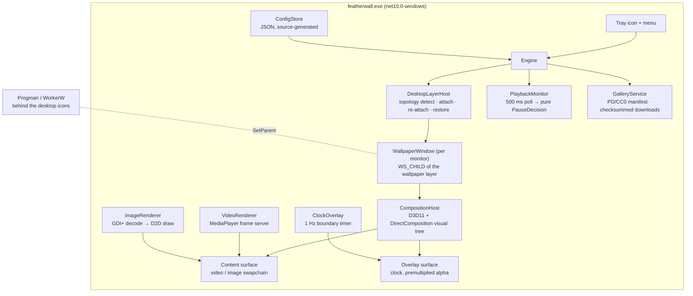

# FeatherWall architecture

One process, five moving parts:

## The interesting part: rendering a wallpaper on Windows 11 24H2+

Every wallpaper engine relies on the same classic trick: send the undocumented message `0x052C` to `Progman`, which spawns a `WorkerW` window behind the desktop icons, and re-parent your window into it. That world ended with the Windows 11 24H2 "raised desktop with layered ShellView" servicing change (rolled out through 25H2, build 26200): `Progman` is created with `WS_EX_NOREDIRECTIONBITMAP`, `SHELLDLL_DefView` (the icons) becomes a layered *child* of Progman, and the wallpaper is drawn by a `WorkerW` *child* below it. Most wallpaper tools black-screen or paint into surfaces that are never shown.

FeatherWall's attach layer (`DesktopLayerHost`) detects the topology at runtime — `GetWindowLongPtr(progman, GWL_EXSTYLE) & WS_EX_NOREDIRECTIONBITMAP` — and handles both:

- **Classic** (Win10, Win11 ≤ 23H2): find the top-level window hosting `SHELLDLL_DefView`, take the next top-level `WorkerW` sibling, `SetParent` into it.
- **Raised** (24H2+): swap `WS_POPUP → WS_CHILD` (never combine them), `SetParent` into **Progman itself**, slot the window directly below `SHELLDLL_DefView` with `SetWindowPos`, and push the shell's own `WorkerW` to `HWND_BOTTOM`.

That gets a window into the right z-slot. It does **not** get pixels on screen. Three empirical findings on build 26200, each load-bearing:

1. **Redirection surfaces are dead there.** GDI painting, blt-model swapchain presents, even `UpdateLayeredWindow` content — none of it is composed for children of the no-redirection-bitmap Progman. The shell composes that subtree through the **visual layer**, so FeatherWall binds a **DirectComposition target** to its window and presents flip-model composition swapchains through a DComp visual tree. That is the same mechanism the shell's own WorkerW uses, and it works on both topologies.
2. **Flip-model backbuffers only accept render operations.** `UpdateSubresource`/`CopyResource` into the backbuffer silently do nothing. Video frames arrive via `MediaPlayer.CopyFrameToVideoSurface` (a GPU video-processor blit — fine); CPU-rendered content (images, the clock) is drawn with **Direct2D `DrawBitmap`** on a render target wrapping the backbuffer.
3. **The visual tree is composed in physical pixels, and the root transform stays identity.** This is the one that cost the most time, because the intuition is backwards. A `96 / GetDpiForWindow(hwnd)` counter-transform on the root visual looks obviously right and is wrong: measured by covering the OS wallpaper with a solid colour on build 26200, identity covers 100 % of a 2560x1600 display at 150 % scaling, while the counter-scale leaves **55.7 % of the screen bare**. DirectComposition composes this target 1:1 with the window, so window bounds, swapchain sizes and visual offsets are already physical and need no correction.

   DPI does still matter, just one layer up. Sizes a *human* authored — the clock's font size and its margins — are in config as plain pixels, so on a second monitor at a different DPI the widget would be the same pixel count and therefore the wrong physical size. `MonitorTracker.DpiScale` resolves that per monitor from `GetDpiForMonitor(MDT_EFFECTIVE_DPI)`, **relative to the primary monitor rather than to 96**, so a single-DPI machine scales by exactly 1.0 and renders identically to v0.1.0. `featherwall --diag` prints each monitor's DPI and its computed widget scale.

One more practical discovery: DWM did not reliably compose a *second* per-widget window target inside the wallpaper layer, so the clock is not a window at all — it is an **overlay visual** in the same composition tree as the wallpaper content. Fewer HWNDs, trivial z-order, click-through by construction. The clock is rendered in a Mond-inspired style — a large light-weight time, a hairline separator, and a small dimmed date — as a GDI+ bitmap drawn onto the overlay surface at most once per second (boundary-aligned timer, re-armed each tick so it never drifts).

## Settings panel

Everything in the render path is raw Win32 + DirectX with no UI framework. The one place a UI toolkit earns its weight is the settings window, so it is a **WinForms `Form` loaded only when opened** (`Tray/SettingsForm.cs`) — the wallpaper pipeline never references it, and closing it frees it. Every control writes straight into the live `AppConfig` and calls back into the engine (`RefreshClock` / `RefreshWallpapers` / `ApplyAudioSettings`), so changes preview instantly. Because renderer swaps reuse the existing window and composition host, changing the fit mode or picking a new wallpaper never flashes the shell wallpaper underneath and never blinks the clock.

### Self-healing

The wallpaper layer is volatile: explorer restarts, the shell destroys/recreates its WorkerW (notably, `SPI_SETDESKWALLPAPER` destroys it on the raised topology — so FeatherWall only issues the desktop refresh on final exit, to restore the user's original wallpaper). `DesktopLayerHost` watches for `EVENT_OBJECT_DESTROY` on the layer via a WinEvent hook and for the `TaskbarCreated` broadcast, then re-probes and re-attaches everything. Session unlock re-validates cached handles.

## Video pipeline

`Windows.Media.Playback.MediaPlayer` (in-box WinRT, no shipped codecs) in **frame-server mode**: `IsVideoFrameServerEnabled = true`, and every `VideoFrameAvailable` event copies the hardware-decoded frame onto the composition surface and presents. Properties that matter:

- `IsLoopingEnabled` — pipeline-level looping, no teardown between iterations (near-seamless; a keyframe at t = 0 makes it exact)
- `RealTimePlayback` — low-latency mode
- `CommandManager.IsEnabled = false` — media keys must not control a wallpaper

Fit modes: *Fill* resizes the content surface to the cover-scaled video and lets the window clip the overflow via a negative visual offset (`CopyFrameToVideoSurface` mishandles rects that overflow the surface, so overflowing target rects are never used); *Fit* letterboxes with a black clear; *Stretch* maps 1:1.

Pausing is just `MediaPlayer.Pause()` — because rendering is event-driven, a paused video generates no frames, no presents, no timer ticks.

## Pause policy

`PlaybackMonitor` polls at 500 ms (WinEvent location hooks are noisier and less reliable) and feeds a **pure, unit-tested decision function** (`PauseDecision.Evaluate`):

- foreground window maximized on the wallpaper's monitor, or covering ≥ 95 % of its work area → pause that monitor
- `SHQueryUserNotificationState` = D3D exclusive fullscreen → pause
- session locked (WTS notifications) / remote session / battery saver → pause (configurable)
- shell windows and FeatherWall's own windows are exempt

## Testing strategy

Pure logic is unit-tested (126 tests): fit-rect math, clock anchor/format/boundary-timer math, per-monitor DPI scaling, the date-styling fallback chain, the pause decision table, the GPU device-loss recovery budget, config round-trip and precedence, gallery manifest invariants (hosts, licenses, checksum shape, unique ids), virtual-screen coordinate mapping.

The interop layer cannot be unit-tested and is verified by running it. Topology detection and per-monitor DPI come out of `--diag`; rendering behind the icons on the raised topology is screenshot-verified; pause/resume transitions and wallpaper restoration on exit are exercised by hand. **What has not been verified on hardware is tracked honestly in [`recovery-matrix.md`](recovery-matrix.md)**, where an unrun row stays empty rather than being filled in from reading the code.
